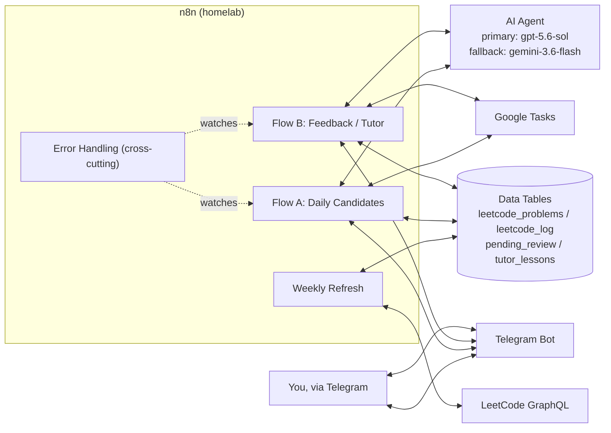
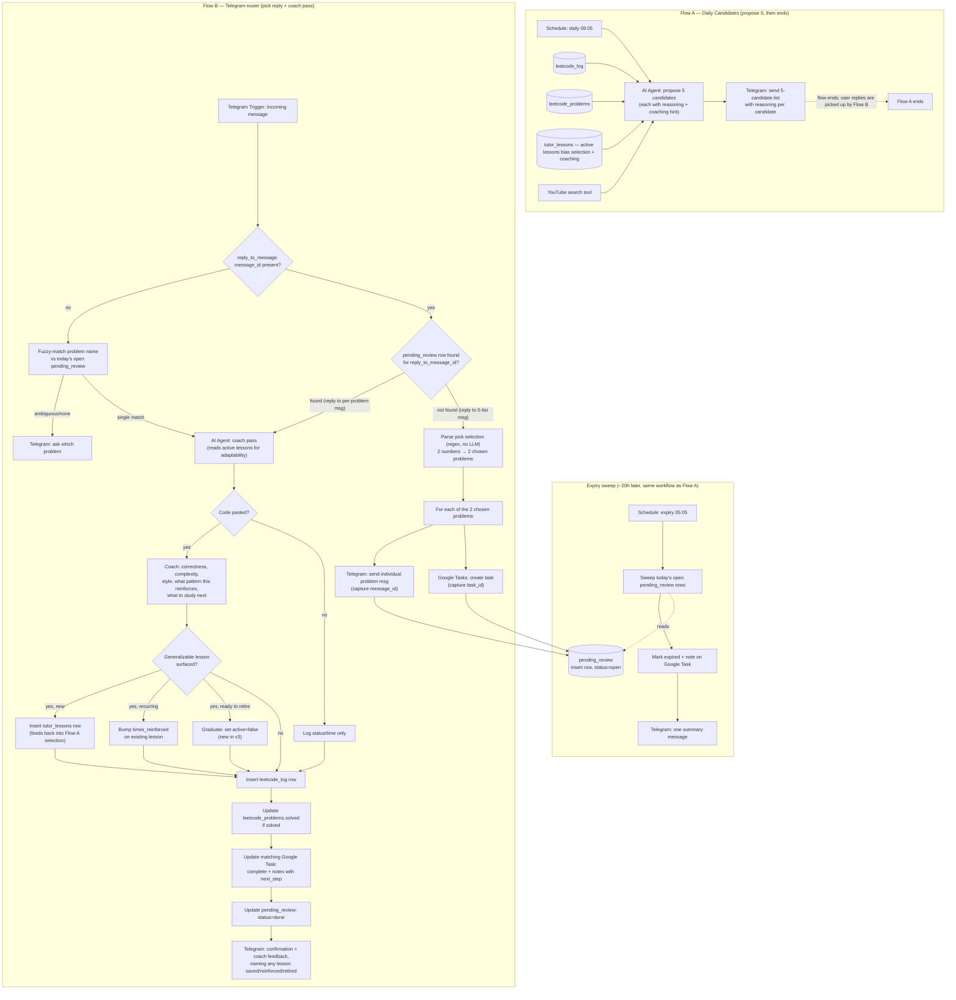

# LeetCode Coach — n8n Revamp Shape (v3)

Status: planning (shape only, not built yet) | Platform: existing homelab n8n | Created: 2026-07-26
Revision: v3 — changes volume to 5-candidates/pick-2, adds per-candidate reasoning + coaching
hints, deepens the tutor into a real coaching pass (not just critique), and makes adaptability
explicit (lessons bias both selection and coaching).

Infra decision (unchanged): **keep n8n, keep the Data Table platform.** This is a workflow-level
revamp, not an infra migration.

---

## Conceptual flow

### System overview — who talks to whom

### Detailed decision flow — Flow A (candidates) and Flow B (feedback)

Flow A is schedule-only: it proposes 5 candidates and ends. Flow B owns the single Telegram
Trigger and routes every incoming reply — both the "2 5" pick reply (to the 5-list message) and
the code/status reply (to a per-problem message). Routing is data-driven: look up
`reply_to_message.message_id` in `pending_review`; found → coach pass, not found → pick parse.

The two diagrams are deliberately different grains: the first is "what system talks to what,"
the second is "what decisions get made, in what order, with what fallback path." Both flows share
the same AI Agent model pair and the same error-handling layer (below) — that's drawn once at the
system level rather than repeated in the detailed diagram.

---

## What changed since v2

- Volume: 5 candidates / pick 3 → **5 candidates / pick 2.** Aligns with the actual daily plan:
  1 hard Python + 1 medium (rotating language). The 5-candidate pool gives variety; picking 2
  keeps the daily load sustainable and leaves room for a separate HackerRank JS slot outside this
  workflow.
- **Reasoning per candidate**: each of the 5 candidates now carries a `reasoning` field explaining
  why it was chosen for you specifically (which weak pattern it targets, which active lesson it
  exercises, why the difficulty is appropriate today). This is shown in the Telegram message so
  you see the coach's logic, not just a list.
- **Coaching hints per candidate**: each candidate carries a `coaching_hint` — a one-line
  personalized note drawn from your active `tutor_lessons` (e.g. "last time you forgot the base
  case in recursion — state it before writing code"). This is included in the per-problem
  Telegram message and in the Google Task notes.
- **Coaching, not just critique, in Flow B**: the coach pass now explicitly coaches — what
  pattern this problem reinforces, what to study next, what the next-level version of this
  problem looks like — instead of only grading correctness/complexity/style.
- **Adaptability made explicit**: `tutor_lessons` now biases both (a) Flow A candidate selection
  (target weak patterns, exercise active lessons) and (b) Flow B coaching (reference the specific
  lesson being reinforced, suggest graduation when a lesson has been reinforced enough times).
  The feedback loop is: Flow B saves a lesson → Flow A reads it next day → Flow B checks if the
  student demonstrated it → repeat or graduate.

What carried over unchanged from v2: persistent tutor memory, dynamic Google Tasks, Google OAuth
fix, 3-layer error handling, model pair (gpt-5.6-sol primary, gemini-3.6-flash fallback), Data
Table schema (all 4 tables unchanged), weekly LeetCode refresh flow.

---

## Model IDs (verified against provider docs, 2026-07-26)

Correcting what I said last time: `gpt-5.6-terra` and `gpt-5.6-luna` **are real, current OpenAI
model IDs** — I was wrong to flag them as unclear. Current OpenAI lineup:

| Model ID | Tier |
|---|---|
| `gpt-5.6-sol` | Flagship — complex reasoning/coding |
| `gpt-5.6-terra` | Balanced intelligence/cost |
| `gpt-5.6-luna` | Cost-sensitive, high-volume |

Gemini side needs a correction: **`gemini-3.1-pro-preview` is the current top Pro model — there
is no "Gemini 3.6 Pro" yet.** The 3.6 line is Flash-only so far (`gemini-3.6-flash`). Full current
relevant lineup:

| Model ID | Tier |
|---|---|
| `gemini-3.1-pro-preview` | Top reasoning tier (Pro) |
| `gemini-3.6-flash` | Latest Flash — fast, cheap, still capable |

**Decision (final)**: run `gpt-5.6-sol` primary, `gemini-3.6-flash` fallback, on **both** flows.
Not `gemini-3.1-pro-preview` — its preview-tier rate limits are much tighter than the GA Flash
model, which matters for an always-on automation more than the small quality gap does for a
fallback path that should rarely fire anyway.

### Cost estimate (verified pricing, 2026-07-25)

| Model | Input /1M tok | Output /1M tok |
|---|---|---|
| `gpt-5.6-sol` | $5.00 | $30.00 |
| `gemini-3.6-flash` | $1.50 | $7.50 |

Assumptions: Flow A (candidate picker) runs 1x/day, ~3,000 input / 500 output tokens (system
prompt + tool lookups + 5-candidate output). Flow B (feedback/tutor) runs up to 3x/day, ~3,000
input / 700 output tokens each (pasted code + tool lookups + tutor critique).

| Scenario | Daily | Monthly (30d) |
|---|---|---|
| **Sol everywhere** (both flows) | $0.14 | **~$4.15** |
| Worst case (long code, verbose feedback, ~2x tokens), Sol everywhere | $0.32 | ~$9.60 |

Fallback calls (Flash side) only add cost when the primary actually fails, which should be rare,
so they're not counted separately above. Even the pessimistic worst-case stays under $10/month.

Still verify these exact model ID strings live in n8n's model dropdown when you build — provider
model catalogs change fast, this table is a snapshot from today.

---

## Data Table schema (all four tables)

Canonical schema — must match `nodes/06-data-table.md` exactly. Column names are case-sensitive and referenced by name in the workflow JSON.

`leetcode_problems`:
- `title` (string) — LeetCode problem title
- `slug` (string) — URL slug, e.g. `two-sum`
- `url` (string) — full URL
- `difficulty` (string) — `easy` / `medium` / `hard`
- `tags` (string) — comma-separated, e.g. `array,hash-map`
- `solved` (boolean) — default `false`
- `last_attempted` (date) — nullable
- `times_attempted` (number) — default `0`

`leetcode_log`:
- `problem_slug` (string) — FK to `leetcode_problems.slug`
- `date` (date) — when the attempt happened
- `status` (string) — `solved` / `reviewed` / `skipped` / `saw_solution`
- `time_spent_min` (number) — nullable
- `tutor_feedback` (string) — nullable; HTML, the agent's critique
- `lesson_title` (string) — nullable; the lesson saved on this attempt, if any

`pending_review` — **tracks up to 2 concurrent open problems per day**:
- `message_id` (number) — Telegram message_id of the per-problem msg; correlation key for reply-to
- `google_task_id` (string) — Google Task ID; for Flow B update
- `problem_slug` (string) — FK to `leetcode_problems.slug`
- `problem_title` (string) — denormalized for fuzzy match
- `proposed_at` (date) — when Flow A sent the msg
- `status` (string) — `open` / `done` / `expired`

`tutor_lessons` — the memory system:
- `title` (string) — short, e.g. `check empty input before binary search`
- `category` (string) — e.g. `binary-search`, `dp`, `graphs`
- `created_at` (date) — first seen
- `times_reinforced` (number) — default `1`; bumped when the same pattern recurs
- `active` (boolean) — default `true`; set `false` when mastered

---

## Flow A — Daily candidates: propose 5 (with reasoning), you pick 2

- Trigger: daily schedule (keep 09:05 or adjust).
- **AI Agent node** (primary `gpt-5.6-sol`, fallback `gemini-3.6-flash` — same pair as Flow B)
  with:
  - Tools: `leetcode_log` read, `leetcode_problems` read, `tutor_lessons` read, YouTube search
    HTTP tool.
  - **Adaptability inputs** (what the agent reads to tailor the 5 candidates):
    1. `leetcode_log` (last 30 rows) — what you attempted recently, status, time spent, which
       lessons fired. Used to avoid repeats and to calibrate difficulty (if you're struggling on
       mediums, don't propose 5 hards).
    2. `leetcode_problems` (unsolved) — the candidate pool.
    3. `tutor_lessons` (active only) — your weak patterns. Each candidate should target at least
       one active lesson where possible, so the daily practice reinforces what the coach flagged.
  - **Per-candidate output** (5 objects, each with):
    - `slug`, `title`, `url`, `tags`, `difficulty` (same as v2)
    - `reasoning` (**new**) — 1-2 sentences explaining why this problem was chosen for you
      specifically. References your data: "targets your weak `heap` pattern (lesson: 'forgets to
      heapify before pop'), medium difficulty because you're 3-for-5 on mediums this week."
    - `coaching_hint` (**new**) — 1-line personalized note drawn from active lessons. Shown in
      the per-problem Telegram message and stored in the Google Task notes. Example: "last time
      you used a nested loop where a hashmap would do — before writing code, ask: can I trade
      space for time?"
  - **Difficulty mix**: the 5 candidates should include 2-3 hard and 2-3 medium, so you can pick
    1 hard + 1 medium. The agent should not propose 5 hards or 5 mediums.
  - Output format: `candidate_list_markdown` (numbered list with reasoning, for Telegram) +
    `candidates` array (structured, for the parser). See `04-ai-agent.md` for the exact prompt.
- Send the 5-candidate list as one Telegram message, with reasoning visible per candidate.
- **Selection step**: you reply with 2 numbers (e.g. "2,5"). A Code node with a regex maps the
  reply to the 2 chosen problems — no LLM needed for this. No response within a reasonable
  window → treat as "skip today," log nothing.
- For **each of the 2 chosen problems**, independently:
  1. Send an individual Telegram message ("Problem 1/2: ...") including the `coaching_hint`.
     Capture its `message_id`.
  2. Create a Google Task via the Tasks tool — title = problem name, notes = pattern/difficulty/
     URL + the `coaching_hint`. Capture the `task_id`.
  3. Insert a `pending_review` row: `message_id`, `google_task_id`, `problem_slug`,
     `problem_title`, `proposed_at`, `status = open`.
- Expiry check (~20h later): sweep **all still-open `pending_review` rows for the day** (max 2) —
  mark each `expired`, mark the matching Google Task with an "expired, not attempted" note (not
  deleted — you may still want the record), send one summary message.

## Flow B — Feedback / coach flow (per-problem, this is the real upgrade)

- Trigger: Telegram Trigger.
- **Correlation** (replaces v1's single-pending-row assumption, since up to 2 can be open):
  1. Check `message.reply_to_message.message_id` on the incoming update. If present, look up
     `pending_review` by that exact `message_id` — deterministic match, no ambiguity.
  2. If the user didn't use Telegram's native reply-to (plain message, no threading): fall back
     to matching a problem name mentioned in the text against today's open `pending_review` rows.
     If zero or multiple matches, send a short clarification prompt ("Which one — 1) X 2) Y?")
     instead of guessing.
- **AI Agent node** (primary `gpt-5.6-sol`, fallback `gemini-3.6-flash`) — the **coach pass**:
  1. Parse status/time/code from the reply.
  2. If code was pasted: real coaching, not just grading:
     - **Correctness** — does it work? What edge case breaks it?
     - **Complexity** — time/space in Big-O, and whether that's optimal for this pattern.
     - **Style/idiom** — language-specific notes (Python idioms if Python, etc.).
     - **Pattern coaching** (**new in v3**) — what pattern/category this problem exercises,
       how it connects to your active `tutor_lessons`, and what the next-level version of this
       problem looks like (e.g. "this is a basic monotonic stack; the next step is 'largest
       rectangle in histogram' which adds a sentinel trick").
     - **Next step** (**new in v3**) — one concrete recommendation: what to study, what problem
       to try next, or "you've got this pattern, move on."
  3. **Adaptability — lesson decision**: decide whether this feedback surfaces a generalizable
     lesson worth persisting. A lesson is generalizable if it's a pattern that applies to
     multiple problems, not a one-off bug. Instruction to the model: only write to
     `tutor_lessons` for habits like "forgets base case," "off-by-one on inclusive/exclusive
     bounds," "over-uses nested loops where a hashmap would do" — not typos. If an existing
     active lesson on the same pattern already exists, bump `times_reinforced` instead of
     creating a duplicate. If a lesson has been reinforced 5+ times and the student demonstrated
     it correctly this time, suggest graduating it (set `active = false`) — the coach says
     "you've demonstrated this pattern consistently, I'm retiring the lesson" in the feedback.
  4. Look up pattern/difficulty from `leetcode_problems`, insert into `leetcode_log` (full
     schema, including `lesson_title` if step 3 fired).
  5. If solved, mark `leetcode_problems.solved = true`.
  6. **Update the matching Google Task**: mark complete, append the coach feedback to the task's
     notes field.
  7. Update the `pending_review` row: `status = done`.
  8. Reply on Telegram with a short confirmation + the coach feedback, explicitly naming any
     lesson saved, reinforced, or retired ("noting this as a pattern: ..." / "reinforcing your
     'check empty input before binary search' lesson (3rd time)" / "retiring the 'base case
     first' lesson — you've demonstrated it 5 times") so you see the memory forming and
     adapting, not just a one-off critique.
- Tools: `leetcode_problems` (get/update), `leetcode_log` (insert), `pending_review` (get/update),
  `tutor_lessons` (get/insert/update), Google Tasks (update).
- **The adaptability loop**: Flow B saves/reinforces/retires lessons → Flow A reads active
  lessons next day → candidates target weak patterns → Flow B checks if the student demonstrated
  the lesson → repeat or graduate. This is the system getting smarter about you over time, not
  just logging attempts.

Weekly refresh flow (LeetCode GraphQL pull → `leetcode_problems`) is unchanged.

---

## Google OAuth "randomly disconnects" — this isn't random, it's a known trigger

Root cause, near-certainly: your GCP OAuth consent screen is in **Publishing Status: Testing**.
Google hard-expires all refresh tokens issued by Testing-status apps after **exactly 7 days**,
regardless of how often the token is used. This is documented, deliberate behavior, not a bug —
it's why the disconnect feels "random" but is actually clockwork on a 7-day cycle from whenever
you last re-authenticated.

**Fix:**
1. Google Cloud Console → APIs & Services → OAuth consent screen → change **Publishing Status**
   from `Testing` to `In production`.
2. Because this is a single-user personal automation, Google will very likely still show an
   "unverified app" warning the next time you go through the consent flow (verification is a
   separate, heavier process reserved for apps requesting sensitive/restricted scopes at scale —
   not required just to flip Testing → Production for personal use). Click **Advanced → Go to
   [app name] (unsafe)** — this is expected and fine for a personal automation only you will ever
   authorize.
3. Re-authenticate the Google credential in n8n one more time after switching to Production —
   this issues a token that isn't subject to the 7-day Testing-mode expiry.
4. Secondary expiry condition to be aware of (not your current problem, but worth knowing): a
   refresh token also expires after **6 months of no use**. Running this daily makes that a
   non-issue going forward.
5. Also worth knowing: Google caps you at **100 refresh tokens per account per OAuth client ID**;
   re-running the consent flow repeatedly during setup/testing can silently invalidate an earlier
   token. Once Production status is confirmed working, avoid re-authenticating unless you
   actually need to.
6. Because Google refresh-token revocation is unrecoverable programmatically (no API to "revive"
   a dead token), the error-handling layer below specifically calls out Google auth failures
   (`invalid_grant`) for a distinct alert rather than letting them fail silently inside a run.

---

## Error handling (3 layers, applied to both flows)

1. **Retry On Fail** (node-level setting) on every AI Agent node and every Google/Data Table
   node — catches transient failures (HTTP 429 rate limit, timeouts, 5xx). Set a small max-tries
   (2-3) with a short wait between attempts; this is the cheap, automatic layer.
   - Known n8n caveat: the AI Agent's native Fallback Model feature has had bugs interacting with
     Retry On Fail — in some versions the node can loop indefinitely retrying the primary model
     even after successfully falling back (n8n issue #18797), and older versions required a
     Fallback Model to be connected even when not wanted (#17140, fixed in a later release).
     Practical mitigation: keep n8n reasonably current, keep Retry On Fail's max tries low (1-2)
     on nodes that also have a Fallback Model connected, and actually test the "primary model
     down" case once after building this rather than assuming the toggle just works.
2. **On Error → Continue using error output** branch on the Google-dependent nodes specifically
   (Tasks create/update), since Google auth is the one piece with a known non-recoverable failure
   mode. Route Google auth errors (`invalid_grant`) to a distinct Telegram message ("Google auth
   expired — re-authenticate in n8n") instead of letting the whole run fail silently or, worse,
   letting the AI agent "log with estimated defaults" the way the old workflow's prompt
   instructed it to do for Discord expiry — that instruction was a reasonable stopgap for a
   missing reply, but it should never apply to an infrastructure failure like a dead credential.
3. **Global Error Workflow** (Error Trigger workflow) as the last-resort net — catches anything
   that escapes layers 1 and 2, sends you one Telegram alert. Costs effectively nothing, fires
   rarely if 1 and 2 are doing their job.

---

## Node-level build docs

Per-node documentation with paste-ready JSON configs, field references, and common-issue
troubleshooting — sourced from n8n docs (2026-07-26). Start with `00-connections-and-general.md`;
every other file assumes you've read it.

Index and build order: [`nodes/README.md`](./nodes/README.md)

| File | Covers |
| --- | --- |
| [`nodes/00-connections-and-general.md`](./nodes/00-connections-and-general.md) | Workflow JSON skeleton, `connections` object, credentials, 3-layer error handling, naming |
| [`nodes/01-schedule-trigger.md`](./nodes/01-schedule-trigger.md) | Daily 09:05 trigger + 05:05 expiry sweep, timezone |
| [`nodes/02-telegram-trigger.md`](./nodes/02-telegram-trigger.md) | Incoming message trigger, `chatIds` allowlist, reply correlation fields |
| [`nodes/03-telegram-send.md`](./nodes/03-telegram-send.md) | Send operations: 5-list, per-problem, confirmation, error notifications |
| [`nodes/04-ai-agent.md`](./nodes/04-ai-agent.md) | AI Agent root + OpenAI/Gemini model sub-nodes + tool sub-nodes, fallback wiring |
| [`nodes/05-google-tasks.md`](./nodes/05-google-tasks.md) | Task create/update + the OAuth "In production" 7-day-refresh-token fix |
| [`nodes/06-data-table.md`](./nodes/06-data-table.md) | 4 table schemas, row get/insert/update/upsert, race-condition guard |
| [`nodes/07-http-request.md`](./nodes/07-http-request.md) | LeetCode GraphQL weekly refresh, loop, 429 handling |
| [`nodes/08-code.md`](./nodes/08-code.md) | Parse selection, correlate reply, lesson decision, expiry sweep |
| [`nodes/09-switch-if.md`](./nodes/09-switch-if.md) | Branch points: has reply_to, lesson action, _skip, _ask |

---

## Open decisions before building the actual n8n nodes

- [x] Model pair: `gpt-5.6-sol` primary / `gemini-3.6-flash` fallback, both flows. Settled.
- [x] Volume: 5 candidates / pick 2 (v3). Settled — see "What changed since v2" above.
- [ ] Decide the exact wording/threshold the coach agent uses to decide "this is a lesson worth
      saving" vs. "this is a one-off, don't clutter the memory table" — worth a first pass, then
      tune after a week of real data. The v3 prompt already gives the agent the
      generalizable-vs-one-off distinction; tune the examples after seeing what it actually saves.
- [ ] Decide the graduation threshold (currently 5+ reinforcements AND correct demonstration).
      v3 ships with 5 as a conservative default; lower it to 3 if lessons retire too slowly,
      raise it to 7 if they retire too eagerly after a week of real runs.
- [ ] Confirm n8n version supports the Fallback Model feature cleanly (check for issue #17140's
      fix) before relying on it as the primary resilience mechanism.

## Next step

Once the above are settled, the next deliverable is either a build checklist (node-by-node, to
build directly in the n8n UI) or a full workflow JSON export — your call on which is more useful
given you already build workflows there directly.
