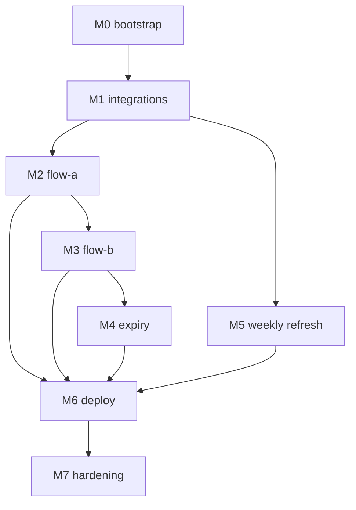

# Project Plan — LeetCode Coach Service

This folder is the **execution backlog** for porting the frozen n8n v3 spec to a
Python FastAPI service. It translates `docs/roadmap.md` into GitHub-style issues
so work can be picked up, tracked, and checked off one unit at a time.

> Sources of truth (do not contradict these):
> - **Behavior:** [`docs/business-requirements.md`](../docs/business-requirements.md)
> - **Design:** [`docs/architecture.md`](../docs/architecture.md)
> - **Plan (phasing/exit criteria):** [`docs/roadmap.md`](../docs/roadmap.md)
> - **Prompts / flow logic (verbatim):** `n8n-reference/workflows/*.json`
>
> If an issue disagrees with a doc, the **doc wins**. Update the issue.

## How to use this backlog

1. Work **milestone by milestone** (phase order is a hard dependency chain).
2. Within a milestone, respect each issue's **Depends on** field.
3. An issue is **done** only when every box in its *Acceptance criteria* is
   checked and its tests are green.
4. When an issue closes, tick the matching checkbox in `docs/roadmap.md`.
5. Do **not** add scope flagged out-of-scope in
   `docs/architecture.md` §12 / `docs/business-requirements.md` §7.
6. Every issue is reviewed against the engineering guardrails in
   [#034](issues/034-engineering-principles-layers.md) — layer responsibilities
   + the principle hierarchy (**KISS first**, then YAGNI, separation of
   concerns, pragmatic SOLID, DRY). When principles conflict, KISS wins.

## Milestones (= roadmap phases)

| Milestone | Phase | Goal | Issues |
|---|---|---|---|
| `M0: bootstrap` | 0 | Skeleton boots, Postgres connected, `/health` 200 | #001–#007, #032, #034 |
| `M1: integrations` | 1 | Every external service behind a typed, retrying client | #008–#014 |
| `M2: flow-a` | 2 | Morning 5-candidate proposal fires to Telegram | #015–#018 |
| `M3: flow-b` | 3 | Pick-parse + coach pass close the loop | #019–#027 |
| `M4: expiry` | 4 | 05:05 sweep marks unanswered problems expired | #028 |
| `M5: weekly-refresh` | 5 | Problem pool auto-refreshes weekly | #029 |
| `M6: deploy` | 6 | Live on Coolify, real proposal next morning | #030, #033 |
| `M7: hardening` | 7 | Post-v1 calibration & fallbacks | #031 |

## Labels

| Label | Meaning |
|---|---|
| `type:feature` | New behavior |
| `type:infra` | Build, deploy, tooling, DB plumbing |
| `type:test` | Test-only or test-heavy work |
| `type:bug-fix` | Fixes a known n8n-v3 defect ported into the port |
| `area:db` | SQLModel / Alembic / Postgres |
| `area:integrations` | Telegram / LLM / Google Tasks / LeetCode / YouTube |
| `area:flow-a` `area:flow-b` `area:expiry` `area:refresh` | Flow code |
| `area:prompts` | Verbatim prompt ports |
| `area:scheduling` | APScheduler cron |
| `area:ops` | Deploy, secrets, observability |
| `risk:high` | Non-deterministic LLM output or auth/secret surface |
| `prio:P0` | Blocks the phase's exit criteria |
| `prio:P1` | Needed for the phase but not blocking others |

## Known bugs being fixed in the port (carry regression tests)

| ID | Bug | Fixed in | Regression test in |
|---|---|---|---|
| BUG-1 | Flow A never received the **unsolved** pool (only `solved = true`) | #016 | #018 |
| BUG-2 | Google Task notes were **replaced** on completion, dropping coach feedback | #026 | #027 |

The three n8n *error-handling* gaps (no retry on Data Table, no typed Google
auth branch, no Telegram trigger `onError`) are closed "for free" by `tenacity`
(#010–#013), a typed `GoogleAuthExpiredError` (#011), and a normal FastAPI
route (#019). No dedicated issues needed.

## Dependency graph (high level)

Within phases the sharp edges are:
- **#003 (models)** blocks nearly everything with DB access.
- **#010 (LLM client)** blocks both prompt flows (#016, #024).
- **#020 (candidate persistence decision)** blocks the pick-parse path (#022)
  and must be **decided, not punted** (roadmap Phase 3a).
- **#016 (Flow A)** must exist before #022 can be tested end-to-end.

## Issue index

### M0 — bootstrap
- [ ] [#001 — Project scaffolding (uv, pyproject, ruff)](issues/001-project-scaffolding.md)
- [ ] [#002 — Config module (pydantic-settings, fail-fast)](issues/002-config-module.md)
- [ ] [#003 — DB layer: 4 SQLModel tables + engine/session](issues/003-db-models.md)
- [ ] [#004 — Alembic initial migration](issues/004-alembic-initial-migration.md)
- [ ] [#005 — FastAPI app, lifespan, `/health`](issues/005-fastapi-app-health.md)
- [ ] [#006 — Dockerfile + docker-compose](issues/006-docker-compose.md)
- [ ] [#007 — Test harness + smoke test](issues/007-test-harness-smoke.md)
- [ ] [#032 — Dev tooling & observability polish](issues/032-dev-tooling-observability.md)
- [ ] [#034 — Engineering principles & layer responsibilities](issues/034-engineering-principles-layers.md)

### M1 — integrations
- [ ] [#008 — Typed error hierarchy + `send_alert`](issues/008-errors-and-alerts.md)
- [ ] [#009 — Telegram client](issues/009-telegram-client.md)
- [ ] [#010 — LLM client (primary + fallback)](issues/010-llm-client.md)
- [ ] [#011 — Google Tasks client (invalid_grant + notes_append)](issues/011-google-tasks-client.md)
- [ ] [#012 — LeetCode GraphQL client (+ Browserless stub)](issues/012-leetcode-client.md)
- [ ] [#013 — YouTube client (optional)](issues/013-youtube-client.md)
- [ ] [#014 — Integration test suite](issues/014-integration-tests.md)

### M2 — flow-a
- [ ] [#015 — Port `propose` prompt verbatim](issues/015-propose-prompt.md)
- [ ] [#016 — `flow_a.propose_5()` (+ BUG-1 fix)](issues/016-flow-a-propose.md)
- [ ] [#017 — APScheduler job for Flow A (09:05)](issues/017-flow-a-cron.md)
- [ ] [#018 — Flow A tests (+ BUG-1 regression)](issues/018-flow-a-tests.md)

### M3 — flow-b
- [ ] [#019 — Telegram webhook route](issues/019-telegram-webhook-route.md)
- [ ] [#020 — Candidate persistence decision](issues/020-candidate-persistence.md)
- [ ] [#021 — Reply correlation / routing](issues/021-flow-b-routing.md)
- [ ] [#022 — Pick-parse path](issues/022-pick-parse-path.md)
- [ ] [#023 — Port `coach` prompt verbatim](issues/023-coach-prompt.md)
- [ ] [#024 — Coach pass call + response parsing](issues/024-coach-pass.md)
- [ ] [#025 — Lesson decision (double-gated graduation)](issues/025-lesson-decision.md)
- [ ] [#026 — Post-coach updates (+ BUG-2 fix)](issues/026-post-coach-updates.md)
- [ ] [#027 — Flow B tests (pick-parse + coach + golden gate)](issues/027-flow-b-tests.md)

### M4 — expiry
- [ ] [#028 — Expiry sweep + cron + tests](issues/028-expiry-sweep.md)

### M5 — weekly-refresh
- [ ] [#029 — Weekly LeetCode pool refresh + cron + tests](issues/029-weekly-refresh.md)

### M6 — deploy
- [ ] [#030 — Deploy to Coolify + GCP OAuth production flip](issues/030-deploy-coolify.md)
- [ ] [#033 — CI/CD pipeline to Coolify (Tailscale-gated)](issues/033-cicd-coolify-tailscale.md)

### M7 — hardening
- [ ] [#031 — Post-v1 hardening backlog](issues/031-hardening-backlog.md)
